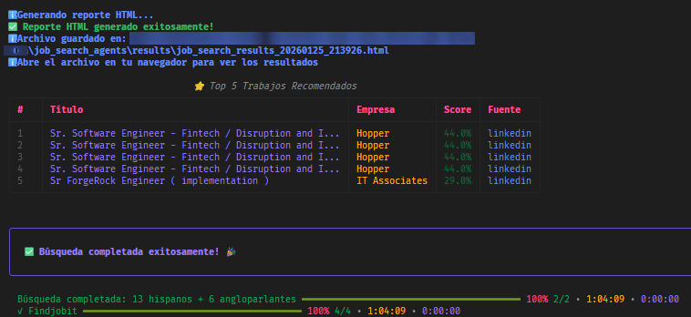

# 🚀 Sistema de Agentes LangGraph para Búsqueda de Empleo

<div align="center">

      

</div>

---

<div align="center">

**Sistema inteligente de búsqueda de empleo que utiliza agentes LangGraph para buscar trabajos en múltiples fuentes, extraer información de contacto y generar un reporte HTML interactivo.**

</div>

---

## 🆕 **NUEVAS CARACTERÍSTICAS LLM-ENHANCED (v2.0)**

<div style="background-color: #e3f2fd; border: 2px solid #2196F3; border-radius: 8px; padding: 20px; margin: 20px 0;">

El sistema ahora incluye capacidades mejoradas por LLM que hacen las búsquedas **significativamente más inteligentes**:

- **🎯 Keywords Adaptativos**: El LLM genera keywords optimizados para cada fuente y región basándose en tu perfil (+30-50% mejor relevancia)
- **🧠 Matching Semántico**: Análisis profundo de relevancia más allá de keywords simples (+40-60% mejor precisión)
- **🔄 Enfoque Híbrido**: Combina matching heurístico rápido con análisis semántico inteligente
- **🌍 Adaptación Regional**: Keywords y análisis específicos para regiones hispanas vs angloparlantes

**📖 Ver [LLM_ENHANCED_FEATURES.md](LLM_ENHANCED_FEATURES.md) para documentación completa.**

</div>

---

## ⚡ **INICIO RÁPIDO** ⚡

```bash
# 1. Instalar dependencias
pip install -r requirements.txt

# 2. Instalar Playwright
playwright install chromium

# 3. Configurar .env (copiar de env.example)

# 4. 🚀 INICIAR EL SISTEMA
python main.py
```

**✨ ¡Listo! El sistema comenzará a buscar trabajos automáticamente**

---

## ⏱️ **TIEMPO DE EJECUCIÓN** ⏱️

<div style="background-color: #fff3cd; border: 2px solid #ffc107; border-radius: 8px; padding: 20px; margin: 20px 0;">

### ⚠️ **IMPORTANTE: Tiempo Estimado del Proceso**

**El proceso completo normalmente puede tardar entre 30 minutos y 1 hora y media**, dependiendo de:

- 💻 **Características de tu máquina** (procesador, RAM, velocidad de disco)
- 🌐 **Velocidad de tu conexión a internet**
- 📊 **Cantidad de trabajos encontrados** en cada fuente
- 🔍 **Número de fuentes habilitadas** en la configuración

**💡 Recomendación**: Deja el sistema ejecutándose y no cierres la terminal. El sistema mostrará el progreso en tiempo real y generará el reporte HTML al finalizar.

</div>

---

## 🎯 Características

<div align="center">

### 🔍 Fuentes de Empleo Soportadas

    

</div>

- **🔍 Búsqueda Multi-Fuente**: Busca en LinkedIn, RemoteOK, We Work Remotely, Stack Overflow Jobs, GitHub Jobs, Findjobit
- **🤖 Agentes Especializados**: Cada fuente tiene su propio agente optimizado con técnicas anti-bot avanzadas
- **📧 Extracción Inteligente de Emails**: Usa LLMs para extraer emails de contacto de las descripciones de trabajo
- **🎯 Matching Inteligente**: Calcula score de match entre trabajos y tu perfil usando matching heurístico + análisis semántico profundo con LLM (híbrido)
- **🤖 Keywords Adaptativos**: Genera keywords optimizados dinámicamente por fuente y región usando LLM (NUEVO)
- **🧠 Análisis Semántico**: Matching semántico inteligente que entiende sinónimos y contexto real (NUEVO)
- **📊 Reporte HTML Interactivo**: Genera un reporte HTML con filtros, estadísticas y visualizaciones
- **🔄 Arquitectura LangGraph**: Workflow coordinado usando LangGraph StateGraph para orquestación de agentes
- **🛡️ Protección Anti-Bot**: Sistema avanzado con rotación de User-Agents, circuit breakers, rate limiting adaptativo y más
- **⚙️ Configuración Flexible**: Variables de entorno para personalizar completamente el comportamiento del sistema
- **✅ Testing Completo**: Suite completa de tests con pytest para pruebas unitarias y validación
- **🏗️ Arquitectura Limpia**: Diseño modular con utilidades compartidas, clases base y manejo adecuado de errores
- **📊 Validación de Configuración**: Modelos Pydantic para validación type-safe de configuración
- **🎯 Sistema de Agent Skills**: Prompts de LLM organizados como skills reutilizables siguiendo el estándar agent-skills, permitiendo fácil gestión, versionado y experimentación de prompts

## 🛠️ Stack Tecnológico

<div align="center">

### Frameworks & Libraries

   

### LLM Providers

 

### Data & Config

  

### Web Technologies

  

</div>

## 📋 Requisitos

<div align="center">

   

</div>

- **Python 3.9+**
- **API Key de OpenAI o Anthropic** (para LLMs)
- **Playwright** (para web scraping)
- **Archivo CV en formato Markdown** (o configura la ruta en variables de entorno)

## 🚀 Instalación Rápida

### 1️⃣ Clonar o navegar al directorio del proyecto

```bash
cd job_search_agents
```

### 2️⃣ Instalar dependencias

```bash
pip install -r requirements.txt
```

### 3️⃣ Instalar navegadores de Playwright

```bash
playwright install chromium
```

### 4️⃣ Configurar variables de entorno

Copia el archivo de ejemplo y personalízalo:

```bash
# Windows
copy env.example .env

# Linux/Mac
cp env.example .env
```

Luego edita el archivo `.env` con tus valores. **Ver sección de Variables de Entorno** para más detalles.

### 5️⃣ Configurar perfil de usuario

Copia el archivo de ejemplo del perfil:

```bash
# Windows
copy data\profile.json.example data\profile.json

# Linux/Mac
cp data/profile.json.example data/profile.json
```

Edita `data/profile.json` con tu información personal y profesional.

## ⚙️ Configuración Inicial Detallada

### 📝 Variables de Entorno Obligatorias

El sistema requiere las siguientes variables para funcionar:

| Variable              | Descripción                                         | Ejemplo                  |
| --------------------- | ---------------------------------------------------- | ------------------------ |
| `USER_EMAIL`        | Tu email de contacto                                 | `tu_email@example.com` |
| `USER_PHONE`        | Tu teléfono (con código de país)                  | `+1234567890`          |
| `ANTHROPIC_API_KEY` | API key de Anthropic (si `LLM_PROVIDER=anthropic`) | `sk-ant-api03-...`     |
| `OPENAI_API_KEY`    | API key de OpenAI (si `LLM_PROVIDER=openai`)       | `sk-...`               |

**⚠️ Importante**: El sistema validará estas variables al inicio y fallará con un mensaje claro si faltan.

### 🔑 Configuración de API Keys

#### Para usar Anthropic (Claude):

```env
LLM_PROVIDER=anthropic
ANTHROPIC_API_KEY=tu_api_key_aqui
LLM_MODEL=claude-3-5-sonnet-20241022
```

Obtén tu API key en: https://console.anthropic.com/

#### Para usar OpenAI:

```env
LLM_PROVIDER=openai
OPENAI_API_KEY=tu_api_key_aqui
LLM_MODEL=gpt-4o-mini
```

Obtén tu API key en: https://platform.openai.com/api-keys

### 📄 Configuración del CV

El sistema busca tu CV en la ruta configurada. Puedes especificarla de dos formas:

#### Opción 1: Ruta absoluta (recomendado para Windows)

```env
CV_PATH=C:\Users\TuUsuario\Mi hoja de vida\CVs_Principales\CV_Dev_Senior_AI_Improvement.md
```

#### Opción 2: Ruta relativa (portable)

```env
CV_PATH=../CVs_Principales/CV_Dev_Senior_AI_Improvement.md
```

#### Opción 3: Valor por defecto

Si no especificas `CV_PATH`, el sistema usará:

```
CVs_Principales/CV_Dev_Senior_AI_Improvement.md
```

(relativo al directorio base del proyecto)

## 📚 Variables de Entorno Completas

El archivo `env.example` contiene todas las variables disponibles con documentación completa. Aquí un resumen por categorías:

### 🔐 API Keys y LLM

| Variable              | Requerida                     | Descripción               |
| --------------------- | ----------------------------- | -------------------------- |
| `ANTHROPIC_API_KEY` | Si `LLM_PROVIDER=anthropic` | API key de Anthropic       |
| `OPENAI_API_KEY`    | Si `LLM_PROVIDER=openai`    | API key de OpenAI          |
| `LLM_PROVIDER`      | No (default:`openai`)       | `openai` o `anthropic` |
| `LLM_MODEL`         | No (default:`gpt-4o-mini`)  | Modelo a utilizar          |

### 👤 Perfil de Usuario

| Variable       | Requerida       | Descripción                   |
| -------------- | --------------- | ------------------------------ |
| `USER_EMAIL` | ✅**Sí** | Email de contacto              |
| `USER_PHONE` | ✅**Sí** | Teléfono con código de país |

### 🔍 Configuración de Búsqueda

| Variable                         | Default   | Descripción                                                                |
| -------------------------------- | --------- | --------------------------------------------------------------------------- |
| `MAX_JOBS_PER_SOURCE`          | `50`    | Máximo de trabajos por fuente                                              |
| `MIN_MATCH_SCORE`              | `60`    | Score mínimo para considerar relevante (0-100)                             |
| `SEARCH_TIMEOUT`               | `30`    | Timeout en segundos                                                         |
| `FAST_MODE`                    | `false` | Habilitar modo rápido (delays reducidos, simulación humana deshabilitada) |
| `EMAIL_EXTRACTION_CONCURRENCY` | `10`    | Número de extracciones de email en paralelo                                |
| `EMAIL_BATCH_SIZE`             | `5`     | Tamaño de lote para extracción de emails                                  |

### 🕷️ Configuración de Scraping

| Variable                   | Default   | Descripción                                     |
| -------------------------- | --------- | ------------------------------------------------ |
| `SCRAPING_DELAY`         | `2.0`   | Delay entre requests (segundos)                  |
| `MAX_RETRIES`            | `3`     | Número máximo de reintentos                    |
| `HEADLESS_BROWSER`       | `true`  | Ejecutar navegador sin interfaz                  |
| `PAGE_LOAD_TIMEOUT`      | `30000` | Timeout de carga de página en milisegundos      |
| `SELECTOR_TIMEOUT`       | `10000` | Timeout de selectores en milisegundos            |
| `REQUEST_TIMEOUT`        | `30`    | Timeout de requests HTTP en segundos             |
| `DESCRIPTION_MAX_LENGTH` | `2000`  | Longitud máxima para descripciones de trabajo   |
| `TITLE_DISPLAY_LENGTH`   | `50`    | Longitud máxima de visualización para títulos |

### 🛡️ Configuración Anti-Bot Básica

| Variable                    | Default  | Descripción                      |
| --------------------------- | -------- | --------------------------------- |
| `USE_USER_AGENT_ROTATION` | `true` | Rotar User-Agent automáticamente |
| `RANDOM_DELAY_ENABLED`    | `true` | Delays aleatorios entre requests  |
| `MIN_DELAY`               | `1.5`  | Delay mínimo (segundos)          |
| `MAX_DELAY`               | `4.0`  | Delay máximo (segundos)          |
| `ENABLE_BROWSER_STEALTH`  | `true` | Modo stealth del navegador        |
| `SIMULATE_HUMAN_BEHAVIOR` | `true` | Simular comportamiento humano     |

### 🔧 Configuración Anti-Bot Avanzada

| Variable                       | Default  | Descripción                           |
| ------------------------------ | -------- | -------------------------------------- |
| `USE_CIRCUIT_BREAKER`        | `true` | Activar circuit breaker                |
| `CIRCUIT_BREAKER_THRESHOLD`  | `5`    | Errores antes de activar               |
| `CIRCUIT_BREAKER_TIMEOUT`    | `300`  | Timeout del circuit breaker (segundos) |
| `USE_SESSION_PERSISTENCE`    | `true` | Mantener sesiones persistentes         |
| `USE_ADAPTIVE_RATE_LIMITING` | `true` | Rate limiting adaptativo               |
| `USE_REFERER_HEADERS`        | `true` | Usar headers Referer                   |
| `USE_SESSION_WARMUP`         | `true` | Warm-up de sesión antes de scraping   |
| `USE_QUERY_VARIATIONS`       | `true` | Generar variaciones de queries con LLM |

### 🤖 Configuración LLM-Enhanced (NUEVO)

| Variable                       | Default | Descripción                                                           |
| ------------------------------ | ------- | --------------------------------------------------------------------- |
| `USE_ADAPTIVE_KEYWORDS`      | `true` | Generar keywords adaptativos por fuente/región con LLM               |
| `USE_SEMANTIC_MATCHING`      | `true` | Análisis semántico profundo de relevancia con LLM                    |
| `SEMANTIC_MATCHING_THRESHOLD` | `50`   | Score mínimo heurístico para análisis semántico (0-100)               |
| `SEMANTIC_MAX_JOBS`           | `100`  | Máximo de trabajos a analizar semánticamente                         |
| `SEMANTIC_WEIGHT`             | `0.6`  | Peso del score semántico en score final (0-1)                        |
| `HEURISTIC_WEIGHT`            | `0.4`  | Peso del score heurístico en score final (0-1, debe sumar 1.0 con SEMANTIC_WEIGHT) |

**📖 Ver [LLM_ENHANCED_FEATURES.md](LLM_ENHANCED_FEATURES.md) para detalles completos sobre estas características.**

### 📁 Configuración de Paths

| Variable       | Default                                             | Descripción         |
| -------------- | --------------------------------------------------- | -------------------- |
| `CV_PATH`    | `CVs_Principales/CV_Dev_Senior_AI_Improvement.md` | Ruta al archivo CV   |
| `OUTPUT_DIR` | `job_search_agents/results`                       | Directorio de salida |
| `DATA_DIR`   | `job_search_agents/data`                          | Directorio de datos  |

### 📝 Configuración de Logging

| Variable      | Default    | Descripción                                                    |
| ------------- | ---------- | --------------------------------------------------------------- |
| `LOG_LEVEL` | `INFO`   | Nivel:`DEBUG`, `INFO`, `WARNING`, `ERROR`, `CRITICAL` |
| `LOG_FILE`  | (opcional) | Archivo de log (si no se especifica, solo consola)              |

### 💾 Configuración de Cache

| Variable               | Default  | Descripción                  |
| ---------------------- | -------- | ----------------------------- |
| `USE_CACHE`          | `true` | Habilitar cache               |
| `CACHE_EXPIRY_HOURS` | `24`   | Expiración del cache (horas) |

### 🔗 API Keys de Job Boards (Opcionales)

| Variable             | Descripción                  |
| -------------------- | ----------------------------- |
| `LINKEDIN_API_KEY` | API key oficial de LinkedIn   |
| `REMOTEOK_API_KEY` | API key de RemoteOK (premium) |

## 📖 Uso

### 🚀 Iniciar el Sistema

<div align="center">

### ⚡ **COMANDO PRINCIPAL** ⚡

```bash
python main.py
```

**🎯 Ejecuta este comando para iniciar la búsqueda de empleo**

</div>

---

El sistema ejecutará el siguiente flujo:

1. ✅ **Validará configuración**: Verificará que todas las variables obligatorias estén configuradas
2. 📄 **Parseará tu CV**: Extraerá información de tu CV desde la ruta configurada
3. 🔍 **Buscará trabajos**: Consultará todas las fuentes habilitadas en paralelo
4. 📧 **Extraerá emails**: Usará LLMs para encontrar emails de contacto en las descripciones
5. 🎯 **Calculará matches**: Comparará cada trabajo con tu perfil y asignará un score
6. 📊 **Generará reporte**: Creará un archivo HTML interactivo con los resultados

### Ejemplo de Salida



*Ejemplo de la salida final mostrando la generación del reporte HTML, los top 5 trabajos recomendados, estadísticas de búsqueda y tiempo total de ejecución (aproximadamente 1 hora y 4 minutos en este ejemplo).*

## 📂 Estructura del Proyecto

```
job_search_agents/
├── agents/                      # 🤖 Agentes especializados
│   ├── orchestrator.py          # Orquestador principal (LangGraph)
│   ├── linkedin_agent.py        # Agente LinkedIn
│   ├── indeed_agent.py          # Agente Indeed (deshabilitado)
│   ├── remote_jobs_agent.py     # Agente trabajos remotos
│   ├── tech_jobs_agent.py       # Agente trabajos técnicos
│   ├── findjobit_agent.py       # Agente Findjobit (LATAM)
│   ├── email_extractor_agent.py # Extracción de emails
│   ├── matcher_agent.py         # Matching con perfil
│   ├── keyword_generator_agent.py # Generación de keywords adaptativos (NUEVO)
│   └── semantic_matcher_agent.py   # Matching semántico inteligente (NUEVO)
│   ├── cv_parser.py             # Parser de CV
│   ├── html_generator.py         # Generador HTML
│   ├── user_agent_rotator.py    # Rotación de User-Agents
│   ├── circuit_breaker.py       # Circuit breaker pattern
│   ├── adaptive_rate_limiter.py # Rate limiting adaptativo
│   ├── url_utils.py             # Utilidades de URL
│   ├── http_helpers.py          # Funciones helper HTTP
│   ├── job_enricher.py          # Utilidades de enriquecimiento de jobs
│   ├── exceptions.py            # Excepciones personalizadas
│   └── ...                      # Más utilidades anti-bot
├── config/                      # ⚙️ Configuración
│   ├── settings.py               # Configuración del sistema
│   ├── validators.py            # Validadores Pydantic
│   ├── config_loader.py         # Cargador de configuración YAML
│   └── job_sources.yaml         # Fuentes de empleo y keywords
├── tools/                       # 🛠️ Herramientas de soporte
│   ├── web_scraper.py           # Web scraping avanzado
│   ├── base_api_client.py       # Clase base para clientes API
│   ├── api_clients.py            # Clientes API
│   ├── email_validator.py        # Validación de emails
│   └── http_client_strategy.py   # Estrategias HTTP
├── tests/                       # 🧪 Suite de tests
│   ├── conftest.py              # Fixtures de pytest
│   ├── test_agents/             # Tests de agentes
│   ├── test_utils/              # Tests de utilidades
│   └── test_config/             # Tests de configuración
├── templates/                   # 📄 Templates HTML
│   └── results_template.html
├── skills/                      # 🎯 Agent Skills (prompts de LLM)
│   ├── email-extractor/         # Skill: extracción de emails
│   ├── query-variator/          # Skill: variaciones de queries
│   ├── keyword-generator/       # Skill: keywords adaptativos (NUEVO)
│   └── semantic-matcher/        # Skill: matching semántico (NUEVO)
│   ├── email-extractor/         # Skill de extracción de emails
│   │   └── SKILL.md
│   ├── job-matcher/             # Skill de matching de trabajos
│   │   └── SKILL.md
│   ├── query-variator/           # Skill de variación de queries
│   │   └── SKILL.md
│   └── README.md                # Documentación de skills
├── data/                        # 💾 Datos
│   ├── profile.json.example     # Ejemplo de perfil
│   └── profile.json              # Tu perfil (no se sube al repo)
├── results/                      # 📊 Resultados HTML
├── main.py                      # 🚀 Punto de entrada
├── env.example                  # 📋 Ejemplo de variables de entorno
├── .env                         # 🔐 Tus variables (no se sube al repo)
├── .gitignore                   # Archivos excluidos del repo
└── requirements.txt             # 📦 Dependencias
```

## ⚙️ Configuración Avanzada

### 🎯 Personalizar Keywords de Búsqueda

**Opción 1: Keywords Estáticos (Tradicional)**

Edita `config/job_sources.yaml` para cambiar los keywords base:

```yaml
keywords:
  - "AI Engineer"
  - "LLMOps Engineer"
  - "Python Senior Developer"
  - "Machine Learning Engineer"
  # Agrega más keywords según tu perfil
```

**Opción 2: Keywords Adaptativos con LLM (Recomendado - NUEVO)**

Si `USE_ADAPTIVE_KEYWORDS=true` (por defecto), el sistema generará automáticamente keywords optimizados para cada fuente y región basándose en tu perfil. Los keywords en `job_sources.yaml` se usan como base y el LLM los adapta dinámicamente.

**💡 Ventaja**: Los keywords adaptativos mejoran la relevancia en un 30-50% comparado con keywords estáticos.

Ver [LLM_ENHANCED_FEATURES.md](LLM_ENHANCED_FEATURES.md) para más detalles.

### 🔄 Filtrar Fuentes de Empleo

Puedes habilitar/deshabilitar fuentes en `config/job_sources.yaml`:

```yaml
job_sources:
  linkedin:
    enabled: true
    max_results: 50
  indeed:
    enabled: false  # Deshabilitado: difícil acceso
    max_results: 50
  remoteok:
    enabled: false  # Deshabilitar esta fuente
```

### 🎚️ Ajustar Score Mínimo

Controla qué trabajos se muestran en el reporte:

```env
MIN_MATCH_SCORE=70  # Solo trabajos con score >= 70
```

### 🛡️ Configuración Anti-Bot para Evitar Bloqueos

Si experimentas bloqueos frecuentes, ajusta estas variables:

```env
# Aumentar delays
SCRAPING_DELAY=3.0
MIN_DELAY=2.0
MAX_DELAY=5.0

# Habilitar todas las protecciones
USE_USER_AGENT_ROTATION=true
RANDOM_DELAY_ENABLED=true
ENABLE_BROWSER_STEALTH=true
SIMULATE_HUMAN_BEHAVIOR=true
USE_CIRCUIT_BREAKER=true
```

### 📝 Configuración de Logging

Para debugging, cambia el nivel de log:

```env
LOG_LEVEL=DEBUG
LOG_FILE=debug.log
```

### 📁 Personalizar Directorios

```env
# Ruta personalizada para resultados
OUTPUT_DIR=/ruta/personalizada/results

# Ruta personalizada para datos
DATA_DIR=/ruta/personalizada/data
```

## 📊 Output

El sistema genera los siguientes archivos:

### 1. 📄 Reporte HTML Interactivo

Archivo generado en `results/job_search_results_YYYYMMDD_HHMMSS.html` con:

- ✅ **Resumen ejecutivo**: Estadísticas generales
- 📋 **Tabla de trabajos**: Ordenados por score de match
- 🔍 **Filtros interactivos**: Por fuente, score, keywords
- 📧 **Lista consolidada de emails**: Todos los emails encontrados
- 📈 **Estadísticas por fuente**: Distribución de trabajos
- 🎯 **Top trabajos recomendados**: Los mejores matches

### 2. 📝 Archivo JSON de Perfil

`data/profile.json` con perfil extraído del CV (se genera automáticamente).

### 3. 📋 Logs

- **Consola**: Progreso en tiempo real
- **Archivo** (si `LOG_FILE` está configurado): Log completo para análisis

## 🔧 Troubleshooting

### ❌ Error: "USER_EMAIL environment variable is required"

**Causa**: Falta configurar variables obligatorias.

**Solución**:

1. Asegúrate de tener un archivo `.env` en el directorio `job_search_agents`
2. Copia `env.example` a `.env` si no existe
3. Configura `USER_EMAIL` y `USER_PHONE` en tu `.env`:
   ```env
   USER_EMAIL=tu_email@example.com
   USER_PHONE=+1234567890
   ```

### ❌ Error: "ANTHROPIC_API_KEY environment variable is required"

**Causa**: Falta la API key del proveedor configurado.

**Solución**:

- Si `LLM_PROVIDER=anthropic`, configura `ANTHROPIC_API_KEY`
- Si `LLM_PROVIDER=openai`, configura `OPENAI_API_KEY`
- Verifica que la variable esté en tu archivo `.env`

### ❌ Error: "No module named 'langgraph'"

**Causa**: Faltan dependencias.

**Solución**:

```bash
pip install -r requirements.txt
```

### ❌ Error: "Playwright browser not found"

**Causa**: Navegador de Playwright no instalado.

**Solución**:

```bash
playwright install chromium
```

### ❌ Error: "CV file not found"

**Causa**: El archivo CV no existe en la ruta configurada.

**Solución**:

1. Verifica que el archivo existe
2. Configura `CV_PATH` en tu `.env` con la ruta correcta:
   ```env
   CV_PATH=C:\ruta\completa\a\tu\cv.md
   ```
3. O coloca tu CV en la ruta por defecto: `CVs_Principales/CV_Dev_Senior_AI_Improvement.md`

### ⚠️ LinkedIn bloqueando requests

**Nota**: Indeed está deshabilitado por defecto debido a bloqueos frecuentes.

**Causa**: Demasiados requests o detección de bot.

**Solución**:

1. Aumenta los delays:
   ```env
   SCRAPING_DELAY=5.0
   MIN_DELAY=3.0
   MAX_DELAY=8.0
   ```
2. Habilita todas las protecciones anti-bot
3. Considera usar APIs oficiales si están disponibles
4. Reduce `MAX_JOBS_PER_SOURCE` para hacer menos requests

### ⚠️ Timeout en búsquedas

**Causa**: Timeout muy corto o conexión lenta.

**Solución**:

```env
SEARCH_TIMEOUT=60  # Aumentar timeout a 60 segundos
```

### ⚠️ Resultados vacíos

**Causa**: Keywords muy específicos o fuentes deshabilitadas.

**Solución**:

1. Revisa `config/job_sources.yaml` y verifica que las fuentes estén habilitadas
2. Ajusta los keywords para ser más generales
3. Reduce `MIN_MATCH_SCORE` para ver más resultados

## 🧪 Testing

El proyecto incluye una suite completa de tests usando pytest. Ejecuta los tests para verificar la funcionalidad:

### Ejecutar Todos los Tests

```bash
pytest
```

### Ejecutar Tests con Cobertura

```bash
pytest --cov=. --cov-report=html
```

### Ejecutar Categorías Específicas de Tests

```bash
# Tests de utilidades
pytest tests/test_utils/

# Tests de agentes
pytest tests/test_agents/

# Tests de configuración
pytest tests/test_config/
```

### Estructura de Tests

- **`tests/conftest.py`**: Fixtures compartidos y configuración de tests
- **`tests/test_utils/`**: Tests para funciones de utilidad (URL utils, HTTP helpers, job enricher, etc.)
- **`tests/test_agents/`**: Tests para funcionalidad de agentes (email extractor, matcher, etc.)
- **`tests/test_config/`**: Tests para validación de configuración

## 🎯 Sistema de Agent Skills

El proyecto utiliza un sistema de **Agent Skills** inspirado en el [estándar agent-skills](https://agentskills.io) para organizar y gestionar los prompts de LLM. Este enfoque separa la lógica de negocio de las instrucciones para LLMs, haciendo que los prompts sean más fáciles de mantener, versionar y experimentar.

### ¿Qué son los Skills?

Los skills son conjuntos de instrucciones reutilizables almacenados en archivos `SKILL.md` con frontmatter YAML. Cada skill contiene:
- **Metadata**: Nombre, descripción, versión, tags
- **System Message**: Instrucciones para el rol del LLM
- **Human Message Template**: Template de entrada del usuario con variables
- **Documentación**: Ejemplos de uso, especificaciones de entrada/salida y mejores prácticas

### Skills Disponibles

El sistema incluye los siguientes skills:

- **`email-extractor`**: Extrae emails de contacto de descripciones de trabajo usando análisis inteligente con LLM. Usado por `EmailExtractorAgent`.
- **`query-variator`**: Genera variaciones naturales de queries de búsqueda para parecer más humanas. Usado por la utilidad `QueryVariator`.
- **`keyword-generator`**: Genera keywords de búsqueda adaptados dinámicamente al perfil, fuente y región. Usado por `KeywordGeneratorAgent`. (NUEVO)
- **`semantic-matcher`**: Analiza semánticamente la relevancia entre trabajos y perfil del candidato. Usado por `SemanticMatcherAgent`. (NUEVO)

### Ventajas del Sistema de Skills

1. **Separación de Concerns**: La lógica de negocio está separada de las instrucciones para LLMs
2. **Fácil Mantenimiento**: Actualiza prompts sin modificar código Python
3. **Mejor Documentación**: Cada skill documenta su propósito, uso y ejemplos
4. **Experimentación**: Prueba diferentes variaciones de prompts fácilmente
5. **Versionado**: Los skills pueden versionarse independientemente
6. **Reutilización**: Los skills pueden compartirse entre agentes

### Usar Skills en el Código

Los agentes cargan skills usando la utilidad `SkillLoader`:

```python
from utils.skill_loader import SkillLoader

# Inicializar loader
skill_loader = SkillLoader()

# Cargar un skill y obtener un ChatPromptTemplate
prompt_template = skill_loader.load_skill("email-extractor")

# Usar con LangChain
chain = prompt_template | llm | output_parser
result = chain.invoke({
    "description": job_description,
    "format_instructions": parser.get_format_instructions()
})
```

### Crear un Nuevo Skill

1. Crea un directorio en `skills/` con el nombre del skill (ej: `skills/mi-skill/`)
2. Crea un archivo `SKILL.md` con frontmatter YAML:

```markdown
---
name: mi-skill
description: Qué hace este skill
version: 1.0.0
agent: langgraph
tags:
  - tag1
  - tag2
---

# Mi Skill

## System Message

Tus instrucciones del sistema aquí...

## Human Message Template

Tu template con {variables} aquí...
```

3. Usa el skill en tu agente:

```python
from utils.skill_loader import SkillLoader

skill_loader = SkillLoader()
self.prompt_template = skill_loader.load_skill("mi-skill")
```

### API del Skill Loader

La clase `SkillLoader` proporciona varios métodos útiles:

```python
# Cargar un skill
prompt = skill_loader.load_skill("email-extractor")

# Obtener metadata del skill
metadata = skill_loader.get_skill_metadata("email-extractor")

# Listar todos los skills disponibles
skills = skill_loader.list_available_skills()

# Validar un skill
es_valido, error = skill_loader.validate_skill("email-extractor")

# Limpiar caché
skill_loader.clear_cache()
```

### Estructura de Archivos de Skill

Cada directorio de skill debe contener:
- `SKILL.md`: Archivo principal del skill con frontmatter e instrucciones
- Opcional: Documentación adicional, ejemplos o archivos de referencia

### Mejores Prácticas

- **Versiona tus skills**: Usa versionado semántico en el frontmatter
- **Documenta exhaustivamente**: Incluye ejemplos de uso y descripciones de variables
- **Prueba los prompts**: Valida skills antes de desplegar
- **Mantén skills enfocados**: Un skill debe manejar una tarea específica
- **Usa nombres descriptivos**: Los nombres de skills deben indicar claramente su propósito

Para más detalles, consulta el archivo [skills/README.md](skills/README.md).

## 🎨 Personalización

### 🎨 Modificar Template HTML

Edita `templates/results_template.html` para personalizar el diseño del reporte. El template usa HTML, CSS y JavaScript vanilla.

### ➕ Agregar Nueva Fuente de Empleo

1. Crea un nuevo agente en `agents/` (ej: `nueva_fuente_agent.py`)
2. Crea cliente API en `tools/api_clients.py` heredando de `BaseAPIClient` si es necesario:
   ```python
   from tools.base_api_client import BaseAPIClient

   class NuevaFuenteClient(BaseAPIClient):
       def __init__(self):
           super().__init__(base_url="https://nueva-fuente.com/api")

       def search_jobs(self, keywords: List[str], **kwargs) -> List[Dict]:
           # Implementación
   ```
3. Agrega el agente al orquestador en `agents/orchestrator.py`
4. Configura en `config/job_sources.yaml`:
   ```yaml
   nueva_fuente:
     enabled: true
     max_results: 50
     base_url: "https://nueva-fuente.com"
   ```
5. La configuración será validada automáticamente usando modelos Pydantic

### 🔧 Personalizar Perfil

Edita `data/profile.json` para reflejar tu perfil exacto. Este archivo se usa para:

- Matching de trabajos
- Extracción de información relevante
- Cálculo de scores

### 🎯 Personalizar Prompts de LLM (Skills)

En lugar de editar código Python para cambiar prompts de LLM, ahora puedes editar los archivos de skills directamente:

1. Navega al directorio `skills/`
2. Encuentra el skill que quieres modificar (ej: `email-extractor/SKILL.md`)
3. Edita las secciones `## System Message` o `## Human Message Template`
4. Guarda el archivo - los cambios toman efecto inmediatamente (¡sin cambios de código!)

Esto hace mucho más fácil:
- Experimentar con diferentes estrategias de prompts
- Ajustar el comportamiento del LLM sin tocar la lógica de negocio
- Versionar cambios de prompts independientemente
- Documentar mejoras de prompts

Ejemplo: Para mejorar la extracción de emails, edita `skills/email-extractor/SKILL.md` y modifica las instrucciones del system message.

## 📝 Notas Importantes

- ⚡ El sistema respeta rate limits y tiene delays entre requests para evitar bloqueos
- 🔒 LinkedIn tiene protección anti-scraping fuerte; puede requerir autenticación o APIs oficiales
- 🔄 Algunas fuentes pueden cambiar sus estructuras HTML, requiriendo actualizaciones del código
- 🎯 El matching usa keywords y heurísticas; para mejor precisión, considera usar embeddings vectoriales
- 📁 Los archivos `.env` y `data/profile.json` están en `.gitignore` y no se suben al repositorio
- 🔐 Nunca compartas tu archivo `.env` con información sensible

## 🤝 Contribuciones

Este es un proyecto personal, pero las mejoras son bienvenidas:

- 🐛 **Reportar bugs**: Abre un issue con detalles del problema
- 💡 **Sugerir mejoras**: Ideas para nuevas funcionalidades
- 🔧 **Mejoras en scraping**: Optimizaciones y nuevas técnicas anti-bot
- ➕ **Nuevas fuentes de empleo**: Agregar más portales de trabajo
- 🎯 **Mejoras en matching**: Algoritmos más precisos
- ⚡ **Optimizaciones de performance**: Hacer el sistema más rápido

## 📄 Licencia

Uso personal.

## 📜 Licencia

Este proyecto está licenciado bajo la **Hippocratic License 3.0**, una licencia de código abierto ética que permite el uso, modificación y distribución del software con restricciones específicas.

### ✅ ¿Qué permite esta licencia?

- ✅ Uso comercial y no comercial
- ✅ Modificación y creación de trabajos derivados
- ✅ Distribución y sublicencia
- ✅ Uso privado

### ❌ ¿Qué prohíbe esta licencia?

La licencia prohíbe el uso del software para:

- ❌ **Propósitos militares agresivos** o violaciones de derechos humanos
- ❌ **Actividades delictivas** o ilegales
- ❌ Violaciones de derechos fundamentales (esclavitud, tortura, discriminación, etc.)
- ❌ Daño al medio ambiente de manera ilegal
- ❌ Cualquier uso que viole los estándares éticos definidos en la Declaración Universal de Derechos Humanos

### 📖 Más información

Para más detalles, consulta el archivo [LICENSE](LICENSE) o visita [firstdonoharm.dev](https://firstdonoharm.dev/version/3/0/core.html).

**Nota**: Esta licencia está diseñada para promover el uso ético del software mientras mantiene la libertad de código abierto para propósitos legítimos.

---

<div align="center">

**Desarrollado con ❤️ usando LangGraph y LangChain para búsqueda inteligente de empleo** 🚀

  

**¿Necesitas ayuda?** Revisa la sección de [Troubleshooting](#-troubleshooting) o consulta el archivo `env.example` para ver todas las opciones de configuración disponibles.

</div>
